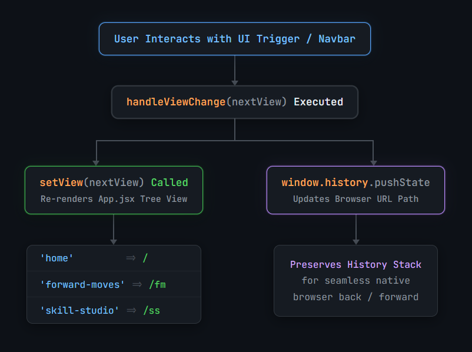
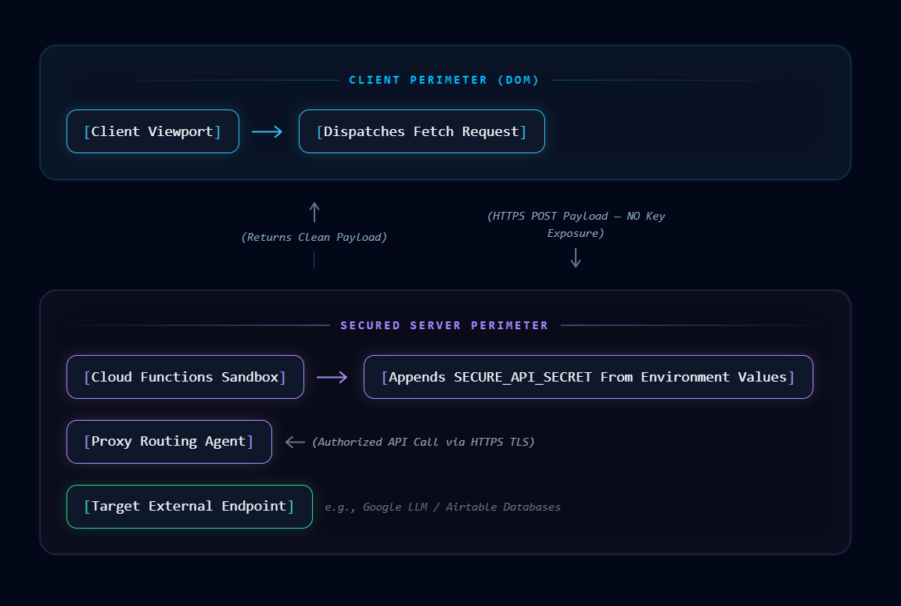

# Yvonne Martinez — Enterprise AI Operations Playbook

An enterprise-grade AI portfolio tracking repository, configuration blueprint, and operations playbook designed for orchestrating premium, high-performance client interface solutions.

---

## 🎯 What is this Project About? (Layman's Terms)

Imagine wanting to transition into a career in Artificial Intelligence but feeling overwhelmed by complicated jargon, not knowing which skills are actually in demand, or struggling to find credible, free courses. 

This project serves as a digital career launchpad called **Forward Moves AI** (a core branch of Yvonne Martinez's unified portfolio platform). It is engineered as a clean, hyper-fast, mobile-friendly environment designed to guide individuals step-by-step into the modern AI workforce. 

Instead of searching the web aimlessly, users arrive at a unified Dashboard Hub that offers four core, high-impact career transition tools:
* **📖 Skill Studio:** A personalized digital classroom that curates top-tier, free AI training modules from trusted providers like Google and Anthropic. Users can choose their target path (e.g., Prompt Architect or AI Systems Developer) and check off completed courses as they learn.
* **📊 Careers:** A live job-market radar that tracks real-time hiring shifts and maps out emerging career paths, helping users target high-velocity sectors like HealthTech, ClimateTech, and FinTech.
* **🌐 AI Career Scout:** A real-time virtual career coach. Powered by **Google's Gemini Pro API**, users can ask highly specific questions about emerging job markets, regional workforce velocities, and technical skill gaps, or receive personalized advice on how to pivot their existing professional experience into AI domains.
* **📁 Glossary System:** A simple, searchable translator that demystifies confusing tech terms (like "RAG," "Tokens," or "Embeddings") and explains them in everyday English.

---

## 🛠️ How We Created It (The Vibe Coding Revolution)

Building a single-page website that loads instantly, handles complex chat interfaces, and renders search queries in milliseconds traditionally required years of computer science background. Instead of writing every line of layout syntax and application logic manually, this repository was engineered using a progressive **AI Pair-Programming Framework** known as **Vibe Coding**.

Here is the exact suite of languages and tools we utilized to create the platform:

### 1. The Full-Stack Polyglot Engine (Languages We Used)
* **JavaScript (ES6+) & JSX:** The core operational engine of our application. We leveraged JavaScript to build out the client-side state machine, process asynchronous browser API calls, handle user interface events, and compute dynamic search metrics in real time.
* **Python:** Used in our AI research sandbox, backend scripting pipelines, and automation data structures. Python scripts handle data parsing, prompt tuning evaluation protocols, and pre-processing pipeline checks before deploying structural constraints to our live cloud infrastructure.
* **HTML5:** Provides the semantic foundational tree and baseline root entry point layout structure for DOM parsing.
* **Modern CSS & CSS Variables:** Serves as the primary global token dictionary and styling baseline. We leveraged deep variable tables to establish reusable design presets, light-tint borders, and layout properties natively parsed by compiled utility classes.

### 2. The Core AI Development Stack
* **Gemini Code Assist (VS Code Extension):** Our primary natural language workspace orchestrator. By installing the official *Gemini Code Assist* tool inside VS Code, we used regular conversational English to edit, refactor, and link multiple files across our workspace simultaneously using Agent mode.
* **Google AI Studio:** The rapid prototyping dashboard where we tested our system prompts, configured safety thresholds, and acquired our production model API keys securely.
* **Firebase & Google Cloud Platform (GCP):** Firebase served as our continuous deployment environment. Because Firebase is natively powered by Google Cloud, our serverless hosting and back-end proxies execute seamlessly on premium Google infrastructure.
* **Firebase CLI (`firebase-tools`):** The command-line engine used to bundle, compile, and push our local files directly live onto custom domain web servers.

### 3. Frontend Architecture (React 19 & Tailwind CSS v4)
We built the interface using **React 19** for high-speed dynamic rendering. For styling, we utilized **Tailwind CSS v4**, a cutting-edge design engine. This allowed us to construct a clean, spacious, minimalist layout—using soft pastel theme borders, plenty of white space, and subtle hover animations that make the site feel premium and natural to navigate.

### 4. The Smart Navigation System (History API)
Traditional websites reload entirely when you click a link, resulting in slow load times. Single-page applications, however, often break the browser's native "Back" and "Forward" buttons, causing user frustration. To solve this, we vibe-coded a **custom History-State Router**. When a user moves from the Homepage to the Skill Studio or Glossary, the app instantly swaps out the view in milliseconds while secretly updating the address bar—ensuring native browser navigation works flawlessly without reloading the page.

### 5. Bulletproof Security & Isolated Serverless AI Routing
When connecting a client web app to intelligent LLM backends like Gemini, exposing private API keys directly in front-end browser logs is a massive security hazard. We structured this platform to follow a **Secure Proxy Pattern**. 
Instead of the user's browser talking directly to third-party endpoints, it communicates with an isolated serverless tier (**Firebase Cloud Functions** running on **Google Cloud**). This backend layer appends hidden environment configuration secrets, manages token consumption limits, and executes **CORS (Cross-Origin Resource Sharing) Defensive Measures**, ensuring credentials are secure and completely insulated from front-end exposure.

---

## 🧭 Table of Contents
- [Yvonne Martinez — Enterprise AI Operations Playbook](#yvonne-martinez--enterprise-ai-operations-playbook)
  - [🎯 What is this Project About? (Layman's Terms)](#-what-is-this-project-about-laymans-terms)
  - [🛠️ How We Created It (The Vibe Coding Revolution)](#️-how-we-created-it-the-vibe-coding-revolution)
    - [1. The Full-Stack Polyglot Engine (Languages We Used)](#1-the-full-stack-polyglot-engine-languages-we-used)
    - [2. The Core AI Development Stack](#2-the-core-ai-development-stack)
    - [3. Frontend Architecture (React 19 \& Tailwind CSS v4)](#3-frontend-architecture-react-19--tailwind-css-v4)
    - [4. The Smart Navigation System (History API)](#4-the-smart-navigation-system-history-api)
    - [5. Bulletproof Security \& Isolated Serverless AI Routing](#5-bulletproof-security--isolated-serverless-ai-routing)
  - [🧭 Table of Contents](#-table-of-contents)
  - [Architectural Diagrams](#architectural-diagrams)
    - [Client-Side State \& Browser History Engine](#client-side-state--browser-history-engine)
    - [Secured Enterprise Proxy Architecture](#secured-enterprise-proxy-architecture)
    - [Prerequisites \& Requirements](#prerequisites--requirements)
  - [Installation Instructions](#installation-instructions)
    - [Terminal Step 1: Clone the Repository](#terminal-step-1-clone-the-repository)
    - [Terminal Step 1a: reminder to change folder](#terminal-step-1a-reminder-to-change-folder)
    - [Terminal Step 1b: Open the Project Folder inside VS Code](#terminal-step-1b-open-the-project-folder-inside-vs-code)
    - [Terminal Step 2: Install Package Dependencies](#terminal-step-2-install-package-dependencies)
    - [Terminal Step 3: Run the Local Development Environment](#terminal-step-3-run-the-local-development-environment)
    - [💡Terminal Execution Note:](#terminal-execution-note)
    - [⚙️ Quick Reference Scripts (Usage Cheat Sheet)](#️-quick-reference-scripts-usage-cheat-sheet)
    - [Terminal Step B: Compile Static Optimization Builds](#terminal-step-b-compile-static-optimization-builds)
    - [Terminal Step C: Production Sandbox Simulation Preview](#terminal-step-c-production-sandbox-simulation-preview)
  - [Phase 1 — Project Initialization \& Folder Scaffolding](#phase-1--project-initialization--folder-scaffolding)
    - [Prompt 1.1 — Building the Core Directory Scaffold](#prompt-11--building-the-core-directory-scaffold)
    - [Terminal Step A: Folder Setup \& Repository Initiation](#terminal-step-a-folder-setup--repository-initiation)
    - [Terminal Git Initialization steps:](#terminal-git-initialization-steps)
    - [Prompt 1.2 — Populating Boilerplate JSX Code](#prompt-12--populating-boilerplate-jsx-code)
    - [🤖 AI Composer System Prompt:](#-ai-composer-system-prompt)
  - [Repository Sync Checkpoint](#repository-sync-checkpoint)
  - [Phase 2 — Tailwind v4 \& Global Styling (Custom Brand Identity)](#phase-2--tailwind-v4--global-styling-custom-brand-identity)
    - [Prompt 2.1 — Brand Typography and Custom Card Tokens](#prompt-21--brand-typography-and-custom-card-tokens)
    - [🤖 AI Composer System Prompt:](#-ai-composer-system-prompt-1)
  - [Repository Sync Checkpoint](#repository-sync-checkpoint-1)
  - [Phase 3 — Multi-View Architecture \& Dynamic Product Sub-Pages](#phase-3--multi-view-architecture--dynamic-product-sub-pages)
    - [Prompt 3.1 — Building Interactive Light-Themed Navigation and Content Views](#prompt-31--building-interactive-light-themed-navigation-and-content-views)
    - [🤖 AI Composer System Prompt](#-ai-composer-system-prompt-2)
  - [Repository Sync Checkpoint](#repository-sync-checkpoint-2)
  - [Phase 4 — Configuration Engine \& Dependency Setup](#phase-4--configuration-engine--dependency-setup)
    - [Prompt 4.1 — Dropping the Node \& Project Configuration Files](#prompt-41--dropping-the-node--project-configuration-files)
    - [🤖 AI Composer System Prompt](#-ai-composer-system-prompt-3)
    - [Prompt 4.2 — Creating the Root HTML Entry Point](#prompt-42--creating-the-root-html-entry-point)
    - [🤖 AI Composer System Prompt](#-ai-composer-system-prompt-4)
  - [Prompt 4.3 — Creating the Main DOM Mount Script](#prompt-43--creating-the-main-dom-mount-script)
    - [🤖 AI Composer System Prompt](#-ai-composer-system-prompt-5)
  - [Prompt 4.4 — App.jsx Orchestration Engine](#prompt-44--appjsx-orchestration-engine)
    - [🤖 AI Composer System Prompt](#-ai-composer-system-prompt-6)
  - [Prompt 4.5 — Purging Unknown Gradient Utility Classes](#prompt-45--purging-unknown-gradient-utility-classes)
    - [🤖 AI Composer System Prompt](#-ai-composer-system-prompt-7)
    - [Prompt 4.6 — Injecting Standard Tailwind v4 Directives](#prompt-46--injecting-standard-tailwind-v4-directives)
    - [🤖 AI Composer System Prompt](#-ai-composer-system-prompt-8)
  - [Repository Sync Checkpoint](#repository-sync-checkpoint-3)
  - [Phase 5 — Core UI Theme \& Layout Realignment](#phase-5--core-ui-theme--layout-realignment)
    - [Prompt 5.1 — Custom Sticky Navigation Header \& Logo Optimization](#prompt-51--custom-sticky-navigation-header--logo-optimization)
    - [🤖 AI Composer System Prompt](#-ai-composer-system-prompt-9)
  - [Prompt 5.2 — Restructuring Component Spacing and Activating the Footer](#prompt-52--restructuring-component-spacing-and-activating-the-footer)
    - [🤖 AI Composer System Prompt](#-ai-composer-system-prompt-10)
  - [Repository Sync Checkpoint](#repository-sync-checkpoint-4)
  - [Phase 6 — Core Root Overrides \& Tab Icon Fixes](#phase-6--core-root-overrides--tab-icon-fixes)
    - [Prompt 6.1 — Direct Inline SVG Escaped Favicon Integration](#prompt-61--direct-inline-svg-escaped-favicon-integration)
    - [🤖 AI Composer System Prompt](#-ai-composer-system-prompt-11)
  - [Phase 7 — Staging Assets \& Sub-Platform Generations](#phase-7--staging-assets--sub-platform-generations)
    - [Prompt 7.1 — Hardcoding the Streamlined 4-Card Dashboard Matrix Block](#prompt-71--hardcoding-the-streamlined-4-card-dashboard-matrix-block)
    - [🤖 AI Composer System Prompt](#-ai-composer-system-prompt-12)
    - [Prompt 7.2 — Skill Studio Integration](#prompt-72--skill-studio-integration)
    - [🤖 AI Composer System Prompt](#-ai-composer-system-prompt-13)
    - [Prompt 7.3 — Engineering the Interactive AI Career Scout Component](#prompt-73--engineering-the-interactive-ai-career-scout-component)
    - [🤖 AI Composer System Prompt](#-ai-composer-system-prompt-14)
  - [Prompt 7.4 — Glossary System Integration](#prompt-74--glossary-system-integration)
    - [🤖 AI Composer System Prompt](#-ai-composer-system-prompt-15)
  - [Repository Sync Checkpoint](#repository-sync-checkpoint-5)
  - [Phase 8 — Environmental Security Architecture](#phase-8--environmental-security-architecture)
    - [Prompt 8.1 — Activating the Master Git Exclusions File](#prompt-81--activating-the-master-git-exclusions-file)
    - [🤖 AI Composer System Prompt](#-ai-composer-system-prompt-16)
    - [Custom Grounding Asset — .gitignore Blueprint Configuration:](#custom-grounding-asset--gitignore-blueprint-configuration)
- [AI-YM-PORTFOLIO/.gitignore](#ai-ym-portfoliogitignore)
- [── SECRET KEY PROTECTION ──](#-secret-key-protection-)
- [── DEPENDENCY EXCLUSIONS ──](#-dependency-exclusions-)
- [── BUILD OUTPUTS ──](#-build-outputs-)
  - [Repository Sync Checkpoint](#repository-sync-checkpoint-6)
  - [Phase 9 — Production Compilation \& Edge Cloud Deployments](#phase-9--production-compilation--edge-cloud-deployments)
    - [Prompt 9.1 — Running the Master Compression Pipelines](#prompt-91--running-the-master-compression-pipelines)
- [Step A: Package compilation tree structure assets](#step-a-package-compilation-tree-structure-assets)
- [Step B: Secure upload folder modules out onto custom domain servers](#step-b-secure-upload-folder-modules-out-onto-custom-domain-servers)
  - [Phase 9 — Production Compilation \& Edge Cloud Deployments](#phase-9--production-compilation--edge-cloud-deployments-1)
    - [Prompt 9.1 — Running the Master Compression Pipelines](#prompt-91--running-the-master-compression-pipelines-1)
- [Step A: Package compilation tree structure assets](#step-a-package-compilation-tree-structure-assets-1)
- [Step B: Secure upload folder modules out onto custom domain servers](#step-b-secure-upload-folder-modules-out-onto-custom-domain-servers-1)
  - [Phase 10 — Memory Engine Rules \& Instruction Settings](#phase-10--memory-engine-rules--instruction-settings)
    - [Global Systemic Behavioral Directives:](#global-systemic-behavioral-directives)
  - [Phase 11 — Environment \& Security Audit Protocol](#phase-11--environment--security-audit-protocol)
    - [Prompt 11.1 — Safe Commit Pre-check Execution](#prompt-111--safe-commit-pre-check-execution)
    - [🤖 AI Composer System Prompt](#-ai-composer-system-prompt-17)
    - [Terminal Sync Checkpoint (Final Audit Step):](#terminal-sync-checkpoint-final-audit-step)
- [Run build to ensure code integrity](#run-build-to-ensure-code-integrity)
- [If build passes, sync to repository](#if-build-passes-sync-to-repository)
  - [Phase 12 — Network \& API Security (CORS)](#phase-12--network--api-security-cors)
  - [Pro-Tip for your Notes:](#pro-tip-for-your-notes)

---

## Architectural Diagrams

### Client-Side State & Browser History Engine


### Secured Enterprise Proxy Architecture


### Prerequisites & Requirements
Ensure your system environment matches these target parameters before initializing setup:  

* **Operating System:** Windows 10/11 (PowerShell), macOS (Zsh Terminal), or Linux.  
* **Node.js Environment:** Version v18.0.0 or higher (v20.x LTS strongly recommended).  
* **Package Manager:** npm (packaged with Node.js) or yarn.  
* **Git Setup:** Configured CLI with target remote authorizations.  
* **Hosting Command Tools:** Firebase CLI (npm install -g firebase-tools).  

## Installation Instructions
Follow these steps to deploy and structure your local workspace sandbox:  

### Terminal Step 1: Clone the Repository
* Bash
```bash
git clone [https://github.com/your-username/ai-ym-portfolio.git](https://github.com/your-username/ai-ym-portfolio.git)
```
  **💡 Username Note:** If you copying the official project, use yvonneim verbatim. If you have already forked this repository to your personal GitHub profile to save your own code modifications, substitute yvonneim with your personal GitHub username.

### Terminal Step 1a: reminder to change folder
  **⚠️ CRITICAL STEP:** You must physically step your terminal session inside the newly downloaded folder before running any package configurations!
* Bash
```bash
cd ai-ym-portfolio
```
### Terminal Step 1b: Open the Project Folder inside VS Code
**To exit:** the "No Folder Opened" blank editor state, load your newly cloned directory into your workspace graphical view.
  **Via Terminal:** Run the execution flag to open the directory path instantly inside a fresh VS Code layout:
* Bash
```bash
code .
```
**Via VS Code GUI:** Navigate to the top options taskbar, click File ➔ Open Folder..., select your local ai-ym-portfolio folder path from your system path tracker, and click Select Folder.

### Terminal Step 2: Install Package Dependencies
Open your integrated VS Code terminal (`Ctrl + ``) and initialize your tracking dependencies:
  * Bash
    ```bash
    npm install
    ```
### Terminal Step 3: Run the Local Development Environment
Launch the real-time hot-reloading rendering environment engine to test live file updates:
   * Bash
    ```bash
    npm run dev
    ```

### 💡Terminal Execution Note: 

This terminal will stay "locked" as long as the server is running. To stop the server at any time, click into the terminal window and press Ctrl + C.

  ### ⚙️ Quick Reference Scripts (Usage Cheat Sheet)
  * This section serves as a quick lookup matrix for future management. Do not execute these concurrently in your active installation terminal row.  Terminal Command: Active Development Sandbox
      * Bash
      ```bash
      npm run dev
      ```
      * Local Port Mapping: http://localhost:5173 
      * Primary Use Case: Run this when you are actively typing code or styling components. It tracks code updates instantly and flashes errors to your window screen.

### Terminal Step B: Compile Static Optimization Builds
* Bash
```bash
npm run build

``` 
      * ** Primary Use Case: Compiles, compresses, and minifies your code into strict production static files inside the local /dist folder destination. (Note: Run this command in a second terminal tab or after stopping your development server with Ctrl + C).
  
### Terminal Step C: Production Sandbox Simulation Preview
* Bash
```bash
    npm run preview
```

* Local Port Mapping: http://localhost:4173

* Primary Use Case: Spins up a lightweight host to view the final compiled results of your /dist folder , ensuring features behave accurately before deploying live onto cloud servers like Firebase
  
## Phase 1 — Project Initialization & Folder Scaffolding   
  
### Prompt 1.1 — Building the Core Directory Scaffold   
    
  * Execution Location: Local System OS Terminal pointed at your target directory root (C:\AI_Portfolio\ai-ym-portfolio).  
    
  * Intent: Generates standard folder configurations and initializes baseline git commit records.  
 
### Terminal Step A: Folder Setup & Repository Initiation
Open a PowerShell tab inside your terminal window
* Create folder matrices natively
* PowerShell
```
mkdir src/components/layout, src/components/ui, src/components/sections, src/context, src/hooks, src/utils, src/assets -Force
```

  * ** Initialize tracking and scaffold boilerplate file markers
  New-Item src/components/layout/Navbar.jsx, src/components/layout/Footer.jsx, src/context/ThemeContext.jsx -Force

  ### Terminal Git Initialization steps:
  * ** Stage baseline layout records
  git init
  git add .
  git commit -m "Initial commit: Empty project architecture and workspace files"
    
      ----
      🛠️ The Git Commands Explained
      1. git init
        What it does: This initializes a brand-new, empty Git repository inside your current folder.

        Why you need it: It wakes Git up and tells it to start tracking this folder. Behind the scenes, it secretly creates a hidden folder named .git where it will log every single code change you make from this moment forward.

      2. git add .
        What it does: The dot (.) means "everything." This command takes all the new folders and placeholder files you just created and moves them to the Staging Area.

        Why you need it: Think of the staging area like a physical shopping cart. Before you check out, you have to place the items inside the cart. git add . tells Git, "Hey, look at all these new folders I just made; I want you to prepare them for saving."

      3. git commit -m "Initial commit..."
        What it does: This takes everything currently sitting in your staging area (your shopping cart) and permanently locks it into your project history as a Commit. The -m stands for "message," which allows you to attach a readable note explaining what changed.

        Why you need it: This officially purchases the items in your cart. It creates a permanent snapshot of your blank project template. If you make a mistake in a later phase, you can use this snapshot to instantly restore your folders back to this exact clean state.
      
      --- 

  ### Prompt 1.2 — Populating Boilerplate JSX Code

  * ** Execution Location: VS Code AI Composer panel (Ctrl + I / Cmd + I) set to Project or Agent mode running Gemini Code Assist.  

  * ** Intent: Generates basic functional structures and mounts them to the root entry point.  

### 🤖 AI Composer System Prompt:
* ** Plaintext

I have initialized our folder architecture and generated empty files for Navbar.jsx, Footer.jsx, and ThemeContext.jsx. 

Please analyze our project workspace and perform the following code generation operations:
1. Populate src/context/ThemeContext.jsx with a fully functional React context provider that manages a 'light' vs 'dark' mode string state, persisting the preference inside the browser's localStorage.
2. Populate src/components/layout/Navbar.jsx with a modern, responsive navigation container utilizing mobile responsive flex layouts, a simple text logo, a theme toggle button hooked to our theme context, and basic navigation links.
3. Populate src/components/layout/Footer.jsx with a clean structural layout displaying a dynamic copyright year script and social link icons.
4. Open src/App.jsx, clear its current placeholder code, import our new layout elements, and wrap the layout components cleanly inside our Theme Provider.

Ensure all file imports match our structural directories flawlessly and output complete, production-ready code.

## Repository Sync Checkpoint
* ** PowerShell
git add .
git commit -m "Complete Phase 1 architecture setup"

## Phase 2 — Tailwind v4 & Global Styling (Custom Brand Identity)
### Prompt 2.1 — Brand Typography and Custom Card Tokens
* ** Execution Location: VS Code AI Composer / Chat panel (Ctrl + I) leveraging Gemini Code Assist.  

* ** Intent: Configures the global style entry sheet with customized Tailwind CSS v4 design variables.

### 🤖 AI Composer System Prompt:
* ** Plaintext
We are using Tailwind CSS v4, which configures design tokens directly inside the main CSS entry point using CSS variables. 

Please locate and open src/index.css. Completely rewrite it to implement our premium light-themed tech aesthetic exactly matching these design rules from our brand assets:

1. Global Styles:
- Primary Background: Crisp, bright light-grey background gradient (#F9F9FB blending smoothly into white)
- Primary Text: Deep charcoal/slate black for headings and body copy to ensure ultra-sharp readability (#111827)
- Accent Colors: Set up a signature electric violet/purple gradient token (#7C3AED to #A855F7)

2. Reusable Card Theme Tokens (Define these as custom classes or CSS variables):
- Create a .card-lavender class: Soft lavender background (#F5F3FF) with a subtle border tint.
- Create a .card-blue class: Soft sky blue background (#EFF6FF) with a subtle border tint.
- Create a .card-cream class: Soft warm peach/cream background (#FFFBEB) with a subtle border tint.
- Create a .card-mint class: Soft mint green background (#F0FDF4) with a subtle border tint.

Ensure all cards feature smooth hover states (like a gentle shadow or slight lift transition). The styling must respect standard HTML semantics and apply beautifully across our components.

## Repository Sync Checkpoint
* ** PowerShell
git add .
git commit -m "Configure customized brand layout, typography, and pastel card utility tokens"

to be continued

## Phase 3 — Multi-View Architecture & Dynamic Product Sub-Pages   
### Prompt 3.1 — Building Interactive Light-Themed Navigation and Content Views
* ** Execution Location: VS Code AI Composer panel (Ctrl + I) in Agent/Project mode via Gemini Code Assist.  

* ** Intent: Constructs a single-page view structure utilizing dynamic rendering to clean up design components.  
 
### 🤖 AI Composer System Prompt
We want to fully scale our React application into a high-end multi-view layout using state management inside src/App.jsx. Ensure that all dark blues, heavy dark backgrounds, or unappealing dark styling blocks are completely removed from the entire application workspace. Every container, background, and text layer must reflect a clean, premium light-themed tech aesthetic (white backgrounds, soft gray transitions, and sharp charcoal text).

Please configure, structure, and connect the following views:

1. Main Portfolio Home View (src/components/sections/PortfolioHome.jsx):
   - Implement the clean white personal portfolio UI with Royal Blue accents as seen on aitogethernow.com.
   - Set up the main tracking badge: "ENTERPRISE AI OPERATIONS & INFRASTRUCTURE".
   - Set up the hero title: "Orchestrating Enterprise AI Implementation."
   - Clicking the primary dark-styled CTA button "EXPLORE FORWARD MOVES AI →" must instantly transition our state to render the Forward Moves sub-platform.

2. Forward Moves Venture Platform View (src/components/sections/ForwardMovesHome.jsx):
   - This page acts as the main Dashboard Hub for the product. Set up a bright grid layout presenting 4 active production entry points utilizing our premium pastel color tokens:
     * Card 1: Skill Studio (Soft lavender style)
     * Card 2: Careers Tracking (Soft blue style)
     * Card 3: AI Career Scout (Soft warm peach/cream style)
     * Card 4: Glossary System (Soft mint green style)
   - Ensure each card is clickable and dynamically triggers a view change to that specific module. Remove any legacy placeholders or layout traps.

3. Top Navigation Synchronization (src/components/layout/Navbar.jsx):
   - Set up const [view, setView] = useState('portfolio') inside src/App.jsx to govern current rendering layout blocks.
   - The Navbar must change its links dynamically based on the current view.
   - When on the portfolio view, display only: "FORWARD MOVES AI" and "CONTACT".
   - When inside any Forward Moves platform view, render the full navigation selection verbatim: "🏡 HOME", "DASHBOARD HUB", "SKILL STUDIO", "CAREERS", "AI CAREER SCOUT", "GLOSSARY". Clicking "🏡 HOME" must seamlessly return the state back to the portfolio home view.

## Repository Sync Checkpoint
* ** PowerShell
git add .
git commit -m "Implement 4-section product grid routing, drop old placeholders, and build dynamic navbar tabs"

## Phase 4 — Configuration Engine & Dependency Setup

### Prompt 4.1 — Dropping the Node & Project Configuration Files   
* ** Execution Location: VS Code AI Composer panel (Ctrl + I) inside Gemini Code Assist.  
* ** Intent: Drops required package declarations and configuration engines directly into the root workspace directory.  
 
### 🤖 AI Composer System Prompt
Please look at our root directory (AI-YM-PORTFOLIO). We need to drop in the formal project configuration files so we can run the real application.

1. Create a package.json file exactly in the root folder with this content:
{
  "name": "ai-ym-portfolio",
  "private": true,
  "version": "0.0.0",
  "type": "module",
  "scripts": {
    "dev": "vite",
    "build": "vite build",
    "preview": "vite preview"
  },
  "dependencies": {
    "react": "^19.0.0",
    "react-dom": "^19.0.0"
  },
  "devDependencies": {
    "@tailwindcss/vite": "^4.0.0",
    "@types/react": "^19.0.0",
    "@types/react-dom": "^19.0.0",
    "@vitejs/plugin-react": "^4.3.4",
    "tailwindcss": "^4.0.0",
    "vite": "^6.0.0"
  }
}

2. Create a vite.config.js file exactly in the root folder with this content:
import { defineConfig } from 'vite'
import react from '@vitejs/plugin-react'
import tailwindcss from '@tailwindcss/vite'

export default defineConfig({
  plugins: [react(), tailwindcss()],
})

### Prompt 4.2 — Creating the Root HTML Entry Point  

* ** Execution Location: VS Code AI Composer panel (Ctrl + I) inside Gemini Code Assist.  Intent: Generates index.html referencing Vite runtime mounting patterns.  🤖 AI Composer System Prompt

### 🤖 AI Composer System Prompt
Please look at our root directory (AI-YM-PORTFOLIO). Vite requires a root entry file to display our app on localhost.

Create an index.html file exactly in the root folder with this content:
<!DOCTYPE html>
<html lang="en">
  <head>
    <meta charset="UTF-8" />
    <meta name="viewport" content="width=device-width, initial-scale=1.0" />
    <title>Yvonne Martinez - AI Operations Portfolio</title>
  </head>
  <body>
    <div id="root"></div>
    <script type="module" src="/src/main.jsx"></script>
  </body>
</html>

## Prompt 4.3 — Creating the Main DOM Mount Script

* ** Execution Location: VS Code AI Composer panel (Ctrl + I) inside Gemini Code Assist.  
* ** Intent: Generates mounting instructions matching React 19 standards.  
 
### 🤖 AI Composer System Prompt
Please look at our src/ directory. We are missing the standard entry point execution file. 

Create a new file at src/main.jsx to anchor our React 19 app to our HTML tree layout. Use this exact source code structure:

import React from 'react'
import { createRoot } from 'react-dom/client'
import App from './App.jsx'
import './index.css'

const container = document.getElementById('root')
const root = createRoot(container)
root.render(
  <React.StrictMode>
    <App/>
  </React.StrictMode>
)

## Prompt 4.4 — App.jsx Orchestration Engine   

* ** Execution Location: VS Code AI Composer panel (Ctrl + I) in Agent/Project mode.  
* ** Intent: Completely rewrites application entrypoint scripts to manage layout states seamlessly.  

### 🤖 AI Composer System Prompt
Please open src/App.jsx. We need to completely rewrite it to manage our 4 production platform views using an advanced client-side state routing mechanism combined with the native browser History API to solve the back button trap. Remove all legacy dark backgrounds or old placeholder variables, and ensure container pathways match our sections perfectly.

Configure src/App.jsx with this verified, complete architecture:

import React, { useState, useEffect } from 'react';
import Navbar from './components/layout/Navbar';
import Footer from './components/layout/Footer';
import PortfolioHome from './components/sections/PortfolioHome';
import ForwardMovesHome from './components/sections/ForwardMovesHome';
import SkillStudioView from './components/sections/SkillStudioView';
import CareersView from './components/sections/CareersView';
import CareerScoutView from './components/sections/CareerScoutView';
import GlossaryView from './components/sections/GlossaryView';

export default function App() {
  const [view, setView] = useState('home');

  const handleViewChange = (nextView) => {
    setView(nextView);
    const urlPath = nextView === 'home' ? '/' : `/${nextView}`;
    window.history.pushState({ view: nextView }, '', urlPath);
  };

  useEffect(() => {
    const handlePopState = (event) => {
      if (event.state && event.state.view) {
        setView(event.state.view);
      } else {
        setView('home');
      }
    };
    window.addEventListener('popstate', handlePopState);
    window.history.replaceState({ view: 'home' }, '', window.location.pathname);
    return () => window.removeEventListener('popstate', handlePopState);
  }, []);

  const renderContent = () => {
    switch (view) {
      case 'home':
        return <PortfolioHome setView={handleViewChange} />;
      case 'forward-moves':
        return <ForwardMovesHome setView={handleViewChange} />;
      case 'skill-studio':
        return <SkillStudioView setView={handleViewChange} />;
      case 'careers':
        return <CareersView setView={handleViewChange} />;
      case 'career-scout':
        return <CareerScoutView setView={handleViewChange} />;
      case 'glossary':
        return <GlossaryView setView={handleViewChange} />;
      default:
        return <PortfolioHome setView={handleViewChange} />;
    }
  };

  return (
    <div className="min-h-screen flex flex-col bg-[#fafafa] text-zinc-900 antialiased">
      <Navbar currentView={view} setView={handleViewChange} />
      <main className="flex-grow w-full max-w-7xl mx-auto px-6 md:px-12 pt-24 pb-16 box-border">
        {renderContent()}
      </main>
      <Footer currentView={view} setView={handleViewChange} />
    </div>
  );
}

## Prompt 4.5 — Purging Unknown Gradient Utility Classes   

* ** Execution Location: VS Code AI Composer panel (Ctrl + I) inside Gemini Code Assist.
* ** Intent: Identifies and replaces broken to-white syntax layouts inside global stylesheets.  
 
### 🤖 AI Composer System Prompt
Please open src/index.css. The Tailwind CSS v4 compiler is throwing a compilation error because of an unknown utility class (to-white). 

Scan the file to locate any dynamic gradient utilities using to-white (for example, look inside our custom .text-gradient or .text-royal-gradient definition rule blocks). Change any broken to-white references to a standard valid layout property or explicitly use color values (like to-transparent or matching background values) so that the @tailwindcss/vite generation plugin compiles successfully without crashing.

### Prompt 4.6 — Injecting Standard Tailwind v4 Directives   
* ** Execution Location: VS Code AI Composer panel (Ctrl + I) inside Gemini Code Assist.  
* ** Intent: Enforces modern @import "tailwindcss"; conventions in src/index.css alongside customized design theme styles.  

### 🤖 AI Composer System Prompt
Please open src/index.css. We need to rewrite it completely to fix the Tailwind v4 build crash regarding 'font-sans'. Ensure that the top of the file explicitly imports Tailwind CSS using the new modern v4 syntax, and configure our custom color tokens and utility classes inside native CSS layers so the compiler reads them perfectly. 

Replace the contents of src/index.css with this exact structure:

@import "tailwindcss";

@theme {
  --color-brand-blue: #1e40af;
  --color-brand-purple: #7c3aed;
}

/* Custom Base Utilities */
.text-gradient {
  background: linear-gradient(135deg, #7c3aed 0%, #a855f7 100%);
  -webkit-background-clip: text;
  -webkit-text-fill-color: transparent;
}

.text-royal-gradient {
  background: linear-gradient(135deg, #1e40af 0%, #3b82f6 100%);
  -webkit-background-clip: text;
  -webkit-text-fill-color: transparent;
}

/* Clean Brand Content Cards */
.card-lavender { background-color: #f5f3ff; border: 1px solid #e0d7ff; }
.card-blue { background-color: #eff6ff; border: 1px solid #dbeafe; }
.card-cream { background-color: #fffbeb; border: 1px solid #fef3c7; }
.card-mint { background-color: #f0fdf4; border: 1px solid #dcfce7; }
.card-violet { background-color: #faf5ff; border: 1px solid #f3e8ff; }
.card-teal { background-color: #f0fdfa; border: 1px solid #ccfbf1; }

## Repository Sync Checkpoint
git add .
git commit -m "Create root index.html entry point for Vite dev server parsing"

## Phase 5 — Core UI Theme & Layout Realignment   
### Prompt 5.1 — Custom Sticky Navigation Header & Logo Optimization   
* ** Execution Location: VS Code AI Composer panel (Ctrl + I) in Agent/Project mode via Gemini Code Assist.  
* ** Intent: Generates responsive sticky navigation with integrated hamburger drawer panels.  

### 🤖 AI Composer System Prompt

Please completely rewrite src/components/layout/Navbar.jsx to manage our exact 4-tool product layout. The navbar container wrapper must stay pinned perfectly to the top of the browser screen under a fixed position context, supporting full mobile responsiveness via an integrated state menu trigger panel.

Incorporate this exact React component code structure:

import React, { useState } from 'react';

export default function Navbar({ currentView, setView }) {
  const [isOpen, setIsOpen] = useState(false);

  return (
    <nav className="fixed top-0 left-0 w-full z-[9999] bg-white/90 backdrop-blur-md border-b border-zinc-100 box-border">
      <div className="max-w-7xl mx-auto h-20 flex items-center justify-between px-6 md:px-12 w-full">
        <button 
          onClick={() => { setView('home'); setIsOpen(false); }} 
          className="flex items-center gap-3 font-sans font-bold text-zinc-900 cursor-pointer text-base bg-transparent border-none p-0 focus:outline-none select-none"
        >
          <div className="w-[38px] h-[38px] bg-[#6c5ce7] text-white rounded-full flex items-center justify-center font-bold text-sm tracking-tight shadow-md shadow-[#6c5ce7]/15 flex-shrink-0">
            Y
          </div>
          <span className="tracking-tight font-extrabold text-zinc-900 text-base">Yvonne Martinez</span>
        </button>

        <div className="hidden md:flex items-center gap-8 h-full">
          {currentView === 'home' ? (
            <button onClick={() => setView('forward-moves')} className="text-xs font-bold uppercase tracking-widest text-zinc-600 hover:text-purple-600 transition-colors cursor-pointer bg-transparent border-none p-0 focus:outline-none">Forward Moves AI</button>
          ) : (
            <div className="flex items-center gap-8">
              <button onClick={() => setView('home')} className="text-xs font-bold uppercase tracking-widest transition-colors cursor-pointer bg-transparent border-none p-0 focus:outline-none text-zinc-500 hover:text-purple-600">🏡 Home</button>
              <button onClick={() => setView('forward-moves')} className={`text-xs font-bold uppercase tracking-widest transition-colors cursor-pointer bg-transparent border-none p-0 focus:outline-none ${currentView === 'forward-moves' ? 'text-purple-600' : 'text-zinc-500 hover:text-purple-600'}`}>Dashboard Hub</button>
              <button onClick={() => setView('skill-studio')} className={`text-xs font-bold uppercase tracking-widest transition-colors cursor-pointer bg-transparent border-none p-0 focus:outline-none ${currentView === 'skill-studio' ? 'text-purple-600' : 'text-zinc-500 hover:text-purple-600'}`}>Skill Studio</button>
              <button onClick={() => setView('careers')} className={`text-xs font-bold uppercase tracking-widest transition-colors cursor-pointer bg-transparent border-none p-0 focus:outline-none ${currentView === 'careers' ? 'text-purple-600' : 'text-zinc-500 hover:text-purple-600'}`}>Careers</button>
              <button onClick={() => setView('career-scout')} className={`text-xs font-bold uppercase tracking-widest transition-colors cursor-pointer bg-transparent border-none p-0 focus:outline-none ${currentView === 'career-scout' ? 'text-purple-600' : 'text-zinc-500 hover:text-purple-600'}`}>AI Career Scout</button>
              <button onClick={() => setView('glossary')} className={`text-xs font-bold uppercase tracking-widest transition-colors cursor-pointer bg-transparent border-none p-0 focus:outline-none ${currentView === 'glossary' ? 'text-purple-600' : 'text-zinc-500 hover:text-purple-600'}`}>Glossary</button>
            </div>
          )}
        </div>

        <button onClick={() => setIsOpen(!isOpen)} className="md:hidden p-2 text-zinc-900 cursor-pointer bg-transparent border-none focus:outline-none flex items-center justify-center">
          {isOpen ? <span className="text-xl font-light block w-6 text-center">✕</span> : <div className="w-6 h-3.5 flex flex-col justify-between items-end"><span className="w-full h-0.5 bg-zinc-900 block rounded"></span><span className="w-4/5 h-0.5 bg-zinc-900 block rounded"></span><span className="w-full h-0.5 bg-zinc-900 block rounded"></span></div>}
        </button>
      </div>

      {isOpen && (
        <div className="absolute top-20 left-0 w-full bg-white border-b border-zinc-200 shadow-xl z-[200] md:hidden">
          <div className="flex flex-col p-8 space-y-5">
            {currentView === 'home' ? (
              <button onClick={() => { setView('forward-moves'); setIsOpen(false); }} className="w-full text-left font-sans font-bold text-xs tracking-widest text-zinc-700 hover:text-purple-600 py-2 cursor-pointer block bg-transparent uppercase focus:outline-none">FORWARD MOVES AI</button>
            ) : (
              <>
                <button onClick={() => { setView('home'); setIsOpen(false); }} className="w-full text-left font-sans font-bold text-xs tracking-widest text-zinc-500 hover:text-purple-600 py-2 cursor-pointer block bg-transparent uppercase focus:outline-none">🏡 Home</button>
                <button onClick={() => { setView('forward-moves'); setIsOpen(false); }} className="w-full text-left font-sans font-bold text-xs tracking-widest text-zinc-700 hover:text-purple-600 py-2 cursor-pointer block bg-transparent uppercase focus:outline-none">Dashboard Hub</button>
                <button onClick={() => { setView('skill-studio'); setIsOpen(false); }} className="w-full text-left font-sans font-bold text-xs tracking-widest text-zinc-700 hover:text-purple-600 py-2 cursor-pointer block bg-transparent uppercase focus:outline-none">Skill Studio</button>
                <button onClick={() => { setView('careers'); setIsOpen(false); }} className="w-full text-left font-sans font-bold text-xs tracking-widest text-zinc-700 hover:text-purple-600 py-2 cursor-pointer block bg-transparent uppercase focus:outline-none">Careers</button>
                <button onClick={() => { setView('career-scout'); setIsOpen(false); }} className="w-full text-left font-sans font-bold text-xs tracking-widest text-zinc-700 hover:text-purple-600 py-2 cursor-pointer block bg-transparent uppercase focus:outline-none">AI Career Scout</button>
                <button onClick={() => { setView('glossary'); setIsOpen(false); }} className="w-full text-left font-sans font-bold text-xs tracking-widest text-zinc-700 hover:text-purple-600 py-2 cursor-pointer block bg-transparent uppercase focus:outline-none">Glossary</button>
              </>
            )}
          </div>
        </div>
      )}
    </nav>
  );
}

## Prompt 5.2 — Restructuring Component Spacing and Activating the Footer   
* ** Execution Location: VS Code AI Composer panel (Ctrl + I) in Agent/Project mode via Gemini Code Assist.  
* ** Intent: Generates responsive footer layouts containing dynamic date generation scripts.  

### 🤖 AI Composer System Prompt
Please rewrite src/components/layout/Footer.jsx to accept our current tracking routing props. We need to turn the static footer layout into a fully active navigation tracker that resets layout windows smoothly back to the top viewport row upon user click.

Use this complete verified structure:

import React from 'react';

export default function Footer({ currentView, setView }) {
  return (
    <footer className="w-full max-w-7xl mx-auto bg-white border-t border-zinc-100 mt-auto box-border">
      <div className="px-6 md:px-12 py-6 flex flex-col sm:flex-row items-center justify-between gap-4 text-[11px] text-zinc-400 font-sans tracking-wide">
        <div className="select-none text-center sm:text-left">© 2026 Yvonne Martinez. Hosted via Firebase Infrastructure.</div>
        <div className="flex items-center gap-6 justify-center sm:justify-end">
          <button onClick={() => { setView('home'); window.scrollTo({ top: 0, behavior: 'smooth' }); }} className={`cursor-pointer hover:text-purple-600 transition-colors bg-transparent border-none p-0 font-medium uppercase tracking-wider focus:outline-none ${currentView === 'home' ? 'text-purple-600' : ''}`}>Explore Platform</button>
          <button onClick={() => { setView('forward-moves'); window.scrollTo({ top: 0, behavior: 'smooth' }); }} className={`cursor-pointer hover:text-purple-600 transition-colors bg-transparent border-none p-0 font-medium uppercase tracking-wider focus:outline-none ${currentView === 'forward-moves' ? 'text-purple-600' : 'text-zinc-500 hover:text-purple-600'}`}>Dashboard Hub</button>
          <a href="mailto:yvonne.martinez@aitogethernow.com" className="hover:text-purple-600 transition-colors no-underline font-medium uppercase tracking-wider">Get in Touch</a>
        </div>
      </div>
    </footer>
  );
}

## Repository Sync Checkpoint
git add .
git commit -m "navigation: complete sticky blur navbar layout overhaul and assign purple Y icon badges"

## Phase 6 — Core Root Overrides & Tab Icon Fixes   
### Prompt 6.1 — Direct Inline SVG Escaped Favicon Integration
* ** Execution Location: Root level index.html.  
* ** Intent: Eradicates default browser tab icons by loading an inline, URL-escaped vector emblem. 

### 🤖 AI Composer System Prompt
<!DOCTYPE html>
<html lang="en">
  <head>
    <meta charset="UTF-8" />
    <meta name="viewport" content="width=device-width, initial-scale=1.0" />
    <title>Yvonne Martinez - AI Operations Portfolio</title>
    <link rel="icon" type="image/svg+xml" href="data:image/svg+xml,%3Csvg xmlns='[http://www.w3.org/2000/svg](http://www.w3.org/2000/svg)' viewBox='0 0 100 100'%3E%3Ccircle cx='50' cy='50' r='46' fill='%236c5ce7'/%3E%3Ctext y='64' x='50' font-family='system-ui,-apple-system,sans-serif' font-size='46' font-weight='900' text-anchor='middle' fill='white'%3EY%3C/text%3E%3C/svg%3E" />
  </head>
  <body>
    <div id="root"></div>
    <script type="module" src="/src/main.jsx"></script>
  </body>
</html>

## Phase 7 — Staging Assets & Sub-Platform Generations
### Prompt 7.1 — Hardcoding the Streamlined 4-Card Dashboard Matrix Block   
* ** Execution Location: VS Code AI Composer panel (Ctrl + I) in Agent/Project mode running Gemini Code Assist.  
* ** Intent: Standardizes card layout vectors inside the product dashboard, matching the live configuration of aitogethernow.com.  

### 🤖 AI Composer System Prompt
Please overwrite src/components/sections/ForwardMovesHome.jsx. We need to implement our precise, final 4-card workspace matrix, completely removing old template placeholders or structural markers to align perfectly with our operational tools.

Replace the file with this clean architecture layout:

import React from 'react';

export default function ForwardMovesHome({ setView }) {
  return (
    <div className="w-full bg-[#FAFAFA] min-h-screen py-16 px-6 md:px-12 flex flex-col items-center">
      <div className="text-center mb-16 max-w-2xl mx-auto space-y-4">
        <div className="text-[10px] font-bold tracking-widest text-purple-600 uppercase">• Forward Moves USA</div>
        <h2 className="font-serif text-4xl md:text-5xl text-gray-900 tracking-tight">Explore What's Inside</h2>
        <p className="text-gray-500 text-sm font-light">Select an active launchpad vector to manage your workforce pivot.</p>
      </div>

      <div className="grid grid-cols-1 sm:grid-cols-2 lg:grid-cols-2 gap-8 max-w-4xl w-full mx-auto">
        {/* Card 1: Skill Studio */}
        <div 
          onClick={() => setView('skill-studio')}
          className="bg-white border border-purple-100 hover:border-purple-300 rounded-2xl p-7 transition-all duration-300 hover:-translate-y-1 hover:shadow-lg hover:shadow-purple-900/5 flex flex-col justify-between min-h-[210px] cursor-pointer group"
        >
          <div>
            <span className="text-2xl block mb-3 group-hover:scale-110 transition-transform origin-left">📖</span>
            <h4 className="font-sans font-bold text-base text-zinc-900 group-hover:text-purple-600 transition-colors mb-2">Skill Studio</h4>
            <p className="text-zinc-500 text-xs font-light leading-relaxed">Access curated technical learning modules, adaptive course matrices, and professional training sandboxes.</p>
          </div>
          <div className="text-[10px] font-bold uppercase tracking-widest text-purple-600 flex items-center gap-1 mt-4">Open Studio Modules →</div>
        </div>

        {/* Card 2: Careers */}
        <div 
          onClick={() => setView('careers')}
          className="bg-white border border-blue-100 hover:border-blue-300 rounded-2xl p-7 transition-all duration-300 hover:-translate-y-1 hover:shadow-lg hover:shadow-blue-900/5 flex flex-col justify-between min-h-[210px] cursor-pointer group"
        >
          <div>
            <span className="text-2xl block mb-3 group-hover:scale-110 transition-transform origin-left">📊</span>
            <h4 className="font-sans font-bold text-base text-zinc-900 group-hover:text-blue-600 transition-colors mb-2">Careers</h4>
            <p className="text-zinc-500 text-xs font-light leading-relaxed">Track live macro employment analytics, job sector hiring graphs, and emerging role velocity vectors.</p>
          </div>
          <div className="text-[10px] font-bold uppercase tracking-widest text-blue-600 flex items-center gap-1 mt-4">Open Employment Tracking →</div>
        </div>

        {/* Card 3: AI Career Scout */}
        <div 
          onClick={() => setView('career-scout')}
          className="bg-white border border-amber-100 hover:border-amber-300 rounded-2xl p-7 transition-all duration-300 hover:-translate-y-1 hover:shadow-lg hover:shadow-amber-900/5 flex flex-col justify-between min-h-[210px] cursor-pointer group"
        >
          <div>
            <span className="text-2xl block mb-3 group-hover:scale-110 transition-transform origin-left">🌐</span>
            <h4 className="font-sans font-bold text-base text-zinc-900 group-hover:text-amber-600 transition-colors mb-2">AI Career Scout</h4>
            <p className="text-zinc-500 text-xs font-light leading-relaxed">Consult with our live conversational AI coach to audit domain skill gaps, technical pathways, and career vectors in real-time.</p>
          </div>
          <div className="text-[10px] font-bold uppercase tracking-widest text-amber-600 flex items-center gap-1 mt-4">Initialize Virtual Coach →</div>
        </div>

        {/* Card 4: Glossary System */}
        <div 
          onClick={() => setView('glossary')}
          className="bg-white border border-fuchsia-100 hover:border-fuchsia-300 rounded-2xl p-7 transition-all duration-300 hover:-translate-y-1 hover:shadow-lg hover:shadow-fuchsia-900/5 flex flex-col justify-between min-h-[210px] cursor-pointer group"
        >
          <div>
            <span className="text-2xl block mb-3 group-hover:scale-110 transition-transform origin-left">📁</span>
            <h4 className="font-sans font-bold text-base text-zinc-900 group-hover:text-fuchsia-600 transition-colors mb-2">Glossary System</h4>
            <p className="text-zinc-500 text-xs font-light leading-relaxed">Break down interface architecture jargon, parameter definitions, and technical structural syntax effortlessly.</p>
          </div>
          <div className="text-[10px] font-bold uppercase tracking-widest text-fuchsia-600 flex items-center gap-1 mt-4">Open Reference Matrix →</div>
        </div>
      </div>
    </div>
  );
}

### Prompt 7.2 — Skill Studio Integration
* ** Execution Location: VS Code AI Composer panel (Ctrl + I) via Gemini Code Assist.  
* ** Intent: Deploys a searchable, multi-provider course catalog for the SkillStudioView module.  

### 🤖 AI Composer System Prompt
Please create a new file at src/components/sections/SkillStudioView.jsx and populate it with a professional, filterable curriculum workspace. It should feature a dropdown for selecting target learning profiles (e.g., Prompt Architect, AI Data Analyst, AI Systems Developer) and a left sidebar with quick tags to filter modules by provider (e.g., Google, Anthropic, DeepLearning, edX). Implement local state storage to allow developers or users to mark modules as completed via a checkbox toggle.

### Prompt 7.3 — Engineering the Interactive AI Career Scout Component

* ** Execution Location: VS Code AI Composer panel (Ctrl + I) via Gemini Code Assist.

* ** Intent: Deploys an advanced chat layout wrapper connected via standard fetch queries to an abstract Firebase functions route to execute zero-exposure API streaming.

### 🤖 AI Composer System Prompt
Please construct the interactive AI Career Scout conversational module by creating a new file at src/components/sections/CareerScoutView.jsx. 

The implementation must fulfill these exact criteria:
1. Establish a premium, message-aligned chat log window using light pastel theme tokens, explicit standard markdown rendering capabilities, and interactive loading skeletons.
2. Formulate a secure asynchronous network payload pipeline pointing directly to our dedicated Firebase function gateway ('/api/chatScout').
3. Embed an immutable system prompt context into the transaction payload. This system persona dictates that the underlying model must act with high-level authority as an Enterprise AI Workforce Director—dissecting parameter constraints, prompt patterns, and engineering paths fluently for navigating traditional job market shifts into technical AI spaces.

## Prompt 7.4 — Glossary System Integration   
* ** Execution Location: VS Code AI Composer panel (Ctrl + I) via Gemini Code Assist.  
* ** Intent: Builds an interactive terminology card library inside the GlossaryView component.  

### 🤖 AI Composer System Prompt
Please create a new file at src/components/sections/GlossaryView.jsx. Build an interactive concept card dictionary containing essential AI definitions (e.g., Generative AI, RAG, Embeddings, Tokens, Agent). Integrate a search field at the top of the card matrix that instantly filters matching vocabulary titles or descriptions as the user types. Apply smooth liftoff transition classes to cards to implement the premium tech aesthetic.

## Repository Sync Checkpoint
git add .
git commit -m "dashboard: expand modular tools structure into verified 4 card interactive tracking layout"

## Phase 8 — Environmental Security Architecture   
### Prompt 8.1 — Activating the Master Git Exclusions File   

* ** Execution Location: VS Code AI Composer panel (Ctrl + I) inside Gemini Code Assist.  
* ** Intent: Generates extensive .gitignore definitions to block local credential variables from leaking into remote repository logs.  

### 🤖 AI Composer System Prompt
Please look at our root project workspace directory. Generate a brand new .gitignore file exactly at the root level. Ensure it explicitly lists .env, .env.local, and node_modules/ to completely secure our local environment parameters against accidental remote repository tracking.

### Custom Grounding Asset — .gitignore Blueprint Configuration:
# AI-YM-PORTFOLIO/.gitignore

# ── SECRET KEY PROTECTION ──
.env
.env.local
*.secret

# ── DEPENDENCY EXCLUSIONS ──
node_modules/
.npm/

# ── BUILD OUTPUTS ──
dist/
build/

## Repository Sync Checkpoint
git add .gitignore
git commit -m "security: deploy root variable gitignore exclusion rules to mask local sandboxes"

## Phase 9 — Production Compilation & Edge Cloud Deployments   

### Prompt 9.1 — Running the Master Compression Pipelines
* ** Execution Location: Local System OS Terminal.  
* ** Intent: Bundles active frameworks into highly optimized structures and deploys files straight to Firebase hosting channels.  

* ** Terminal Action Steps:
* ** PowerShell
# Step A: Package compilation tree structure assets
npm run build

# Step B: Secure upload folder modules out onto custom domain servers
firebase deploy --only hosting

## Phase 9 — Production Compilation & Edge Cloud Deployments   

### Prompt 9.1 — Running the Master Compression Pipelines 
* ** Execution Location: Local System OS Terminal.  
* ** Intent: Bundles active frameworks into highly optimized structures and deploys files straight to Firebase hosting channels.
*   
* ** Terminal Action Steps:
# Step A: Package compilation tree structure assets
npm run build

# Step B: Secure upload folder modules out onto custom domain servers
firebase deploy --only hosting

## Phase 10 — Memory Engine Rules & Instruction Settings   

### Global Systemic Behavioral Directives:

* ** Automated Variable Scaffolding: Any subsequent utility integration recommendation will dynamically separate private credentials from client component markup layers.  

* ** Proactive Repository Audit Warnings: Installation prompts will automatically feature validation scripts to prevent accidental pushes of configuration files.  

* ** Frontend Exposure Warnings: Subpage tools requiring private API tokens will automatically recommend secure backend proxy pipeline designs.  

## Phase 11 — Environment & Security Audit Protocol   
### Prompt 11.1 — Safe Commit Pre-check Execution   

* ** Execution Location: VS Code AI Composer panel (Ctrl + I) via Gemini Code Assist.  

* ** Intent: Initiates a strict safety and compliance review of code assets before git synchronization pipelines execute.  

### 🤖 AI Composer System Prompt
Before committing any new feature or data integration, perform a final safety audit of the workspace.

Secret Leak Scan: Verify that no API keys, credentials, or .env variables have been inadvertently included in src/ or components/ files.

Dependency Integrity: Confirm node_modules and .vite caches are correctly ignored by checking .gitignore.

Clean Build: Run npm run build to ensure the compilation logic remains valid and no new "to-white" or undefined utility tokens have been introduced.

Credential Isolation: If any new external services are added, verify they are configured to call through a secured proxy rather than direct client-side requests.

### Terminal Sync Checkpoint (Final Audit Step):
PowerShell# Verify nothing is staged that shouldn't be
git status

# Run build to ensure code integrity
npm run build

# If build passes, sync to repository
git add .
git commit -m "Security Audit: Verify environment isolation and clean build compliance"
  
## Phase 12 — Network & API Security (CORS)
1. Understanding the Role of CORSCORS is a browser-level security feature. If your frontend attempts to fetch data from an external server (like a spreadsheet API or backend service), the server must explicitly whitelist your origin.  
2. Local vs. Production Security   
   * ** During Development: You might run into "CORS errors" if your API doesn't recognize localhost:5173. Configure your proxy in vite.config.js to route requests through the dev server, which hides the origin from the browser.  
   * ** In Production: Never disable CORS settings on your server to "make it work". Only allow specific, trusted origins in your backend/API headers.  
3. Deep-Dive: Secure AI Orchestration Proxy Engine   To activate the live conversational processing streams inside the AI Career Scout without leaking structural master access codes to the client viewport DOM, this repository standardizes on an enterprise-grade token abstraction pattern.  

      * ** Plaintext
      [Client Chat Component (DOM)] ────────────(Asynchronous HTTPS JSON Prompt)───────────► [Firebase Cloud Function]
                                                                                                    │
                                                                                (Injects Server ENV API Secret Key)
                                                                                                    │
                                                                                                    ▼
      [Client Chat Component (DOM)] ◄──────────(Returns Structural Text Stream)─────────── [Google Gemini Pro AI Core Engine]


      * ** Client Isolation: The user inputs an inquiries thread into the UI panel. The React layer packages the raw history data structures array and runs an encrypted fetch query calling our isolated cloud directory. Front-facing script inspectors cannot look up keys because no key parameters ever touch client memory blocks.  
      * ** Serverless Node Decoupling: The request maps into the localized, secure cloud sandbox (Firebase Cloud Functions Proxy running on Google Cloud). The module runs cross-origin request verifications against our specific domain (aitogethernow.com), parses the prompt body, and attaches the private environment string token managed by Google AI Studio.  
      * ** Model Inference Pipeline: The runtime relays the fully compiled payload packet directly to the underlying model (Google Gemini Pro Inference Engine). The model computes contextually grounded, low-latency text payloads, passing a sanitized data stream block back through the proxy gate into your frontend client stack.
4. Audit Checklist for Network Requests:
      * ** [ ] Does the API request include a sensitive API_KEY or AUTH_TOKEN? If yes, move to server-side proxy.  
      * ** [ ] Is the API origin configured to allow your domain (aitogethernow.com) specifically, rather than a wildcard *?
      * ** [ ] Are all sensitive endpoints protected by HTTPS?
   
## Pro-Tip for your Notes:   
Since you are using Firebase for hosting, utilize Firebase Cloud Functions as your "Secure Proxy". This allows you to write the backend code that handles the API keys, and your React front-end just calls the function. This effectively makes CORS errors much easier to manage because you control both ends of the connection.  

👋 Contributing   

We welcome contributions from structural AI developers, systems architects, and technical educators! To contribute:  
1. Fork the repository to your own account.  
2. Create a feature branch: git checkout -b feature/awesome-addition.  
3. Commit your changes following our Phase 11 Environment & Security Audit Protocol: git commit -m "feat: add comprehensive course track".  
4. Push your branch: git push origin feature/awesome-addition.  
5. Open a Pull Request detailing your changes.  📄 License   
 
This project is licensed under the MIT License. You are free to use, modify, and distribute this software for personal and commercial projects. See LICENSE for details.  

💡 Reminders for the Future   

The Sizing System of Markdown Headings   

Always keep your outline files scannable and logically structured by allocating a single hashtag # exclusively for the document header title block, a secondary double hashtag ## for structural milestones/Phases/Sync points, and a triple hashtag ### for instructional prompts or local terminal tasks.  

Handling the Local White-Screen Hot-Reload Crash   

If the local preview server throws a gensync compilation error or crashes while editing, kill the process (Ctrl + C), clear the internal cache by running npm r -f node_modules/.vite, and reboot clean via npm run dev.  

Forcing Favicon Cache Updates   

Browsers aggressively save tab icons. If an icon change doesn't show immediately, close all open tabs pointed to the domain, open a fresh Incognito panel, navigate to the site, and press Ctrl + F5 (or Cmd + Shift + R on Mac) to force-evict old images from memory.  

Airtight Web App Scaling   

When adding new subpage tools, always place the core information array inside the structured conditional loops of src/App.jsx and pass down navigation functions explicitly as layout view component props. This maintains your fast, 100% cloud-independent deployment cadence.  

